# Heater

Heater is a team app.

- There are multiple organizations.
- There are multiple teams.
- Teams are part of organizations.
- Each team can have multiple events.
- Each event can have multiple metrics associated with it.

Simple, right?

- A user can join join multiple teams of multiple organizations and thus become a team member.
- Any team member can create a new event and define a list of metrics for this event.
- Other team members (of the same team) get notified of new events on their profile page.
- A team member can then visit the page of an event and submit their current judgment of any metric defined for this event. There are three possible judgments: "Yeah!", "OK." and "Argh!".
- To get an impression of an event, any team member can visit an event's page and get a view of the general judgment for the metrics of this event, as well as individual team member judments.

Get it?

- There are event presets: "CHAMPFROGS", "Maslow", "SCARF", "Self-Determination Theory", ...
- A preset is simply a template for a new event which already has metrics (with descriptions) associated with it.
- An event page shows how individual metrics are *valued* by the team members in general and how the team members *rank* their importance.
- Every team member can create new organizations or new teams.
- A team member's profile is public.

Done.

## Screenshots

**Login Page**

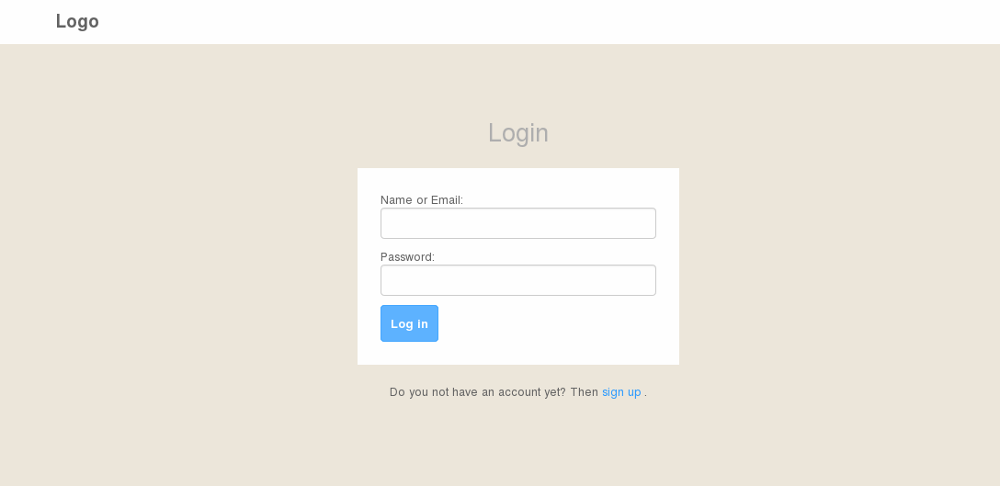

**User Profile**

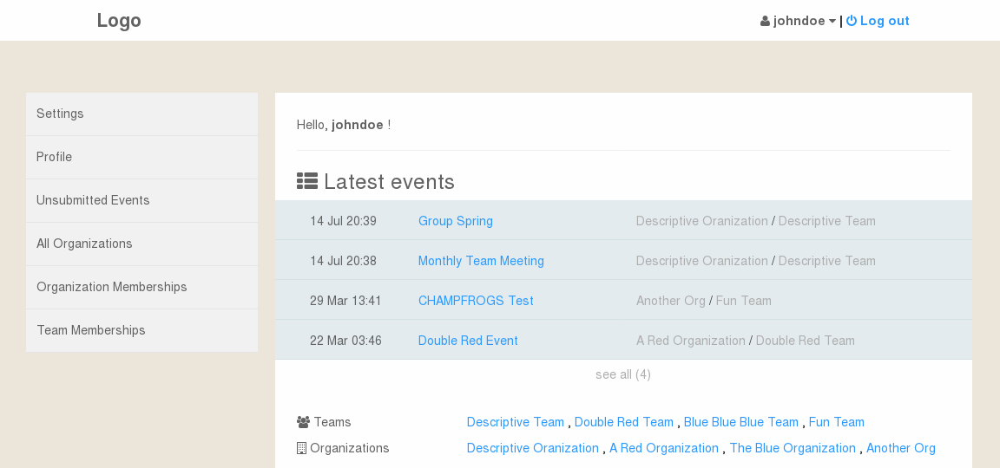

**Organizations Overview**

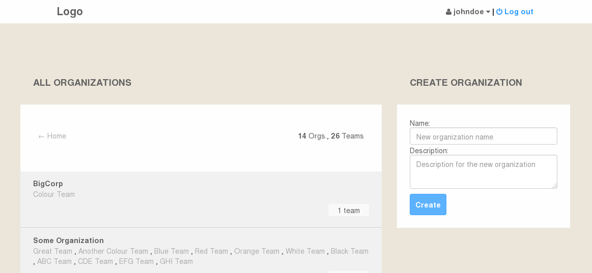

**An Organization Profile Page**

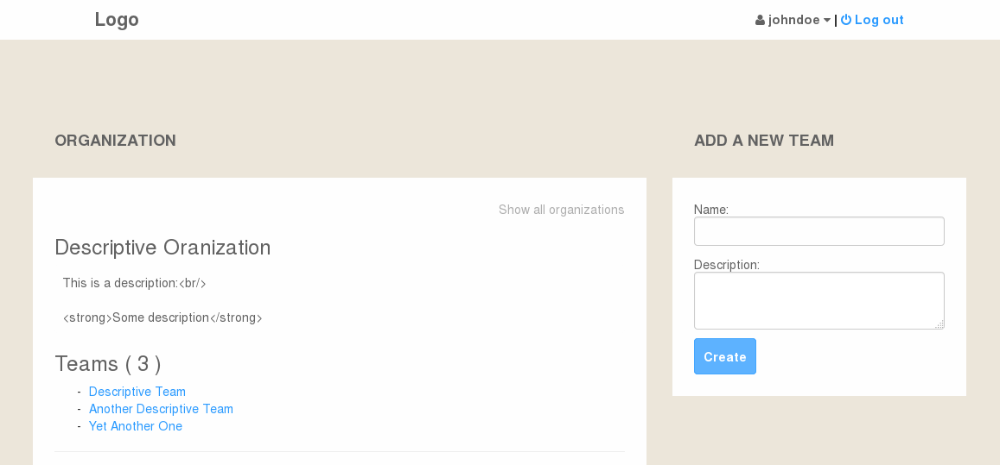

**A Team Profile Page**

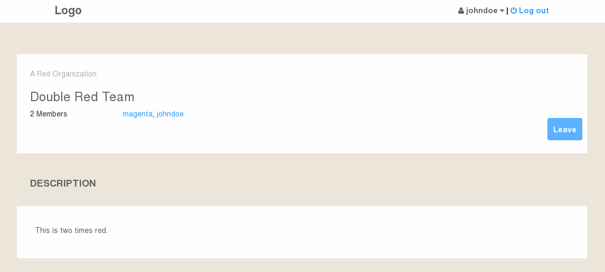

**Event Creation**

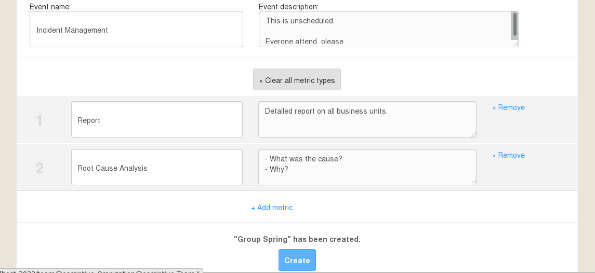

**Event Presets**

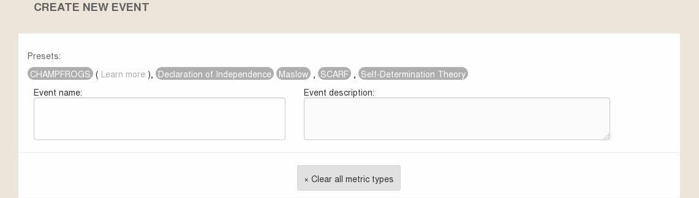

**Metrics Creation**

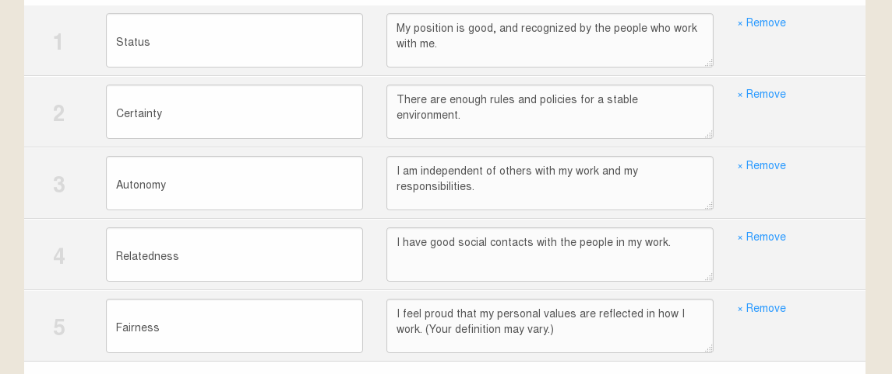

**Metrics Cards**

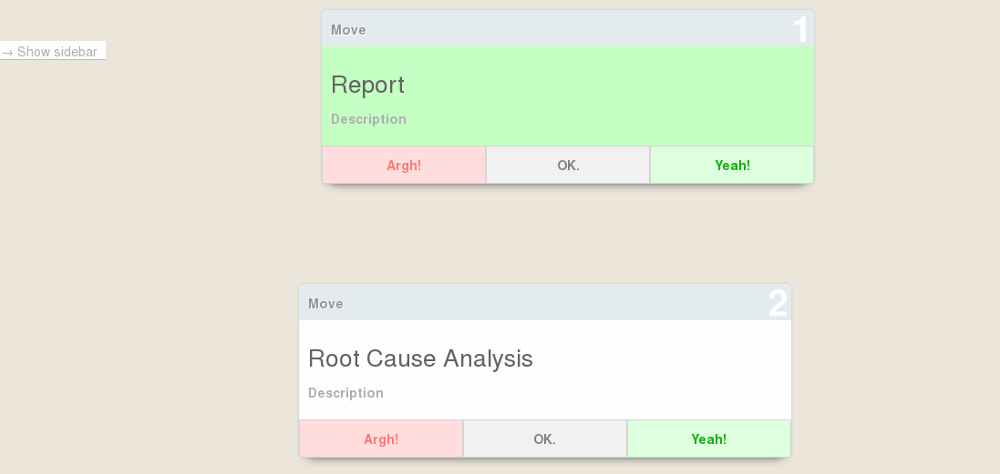

**Metrics Cards Movement**

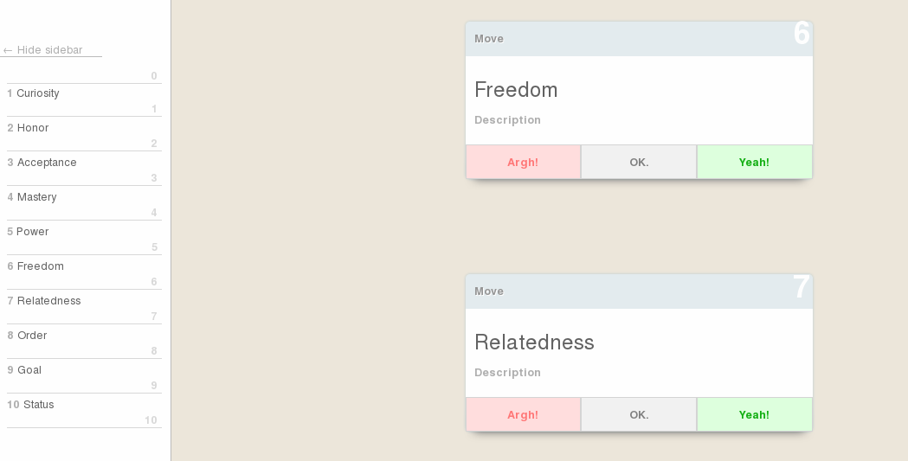

**Event Overview**

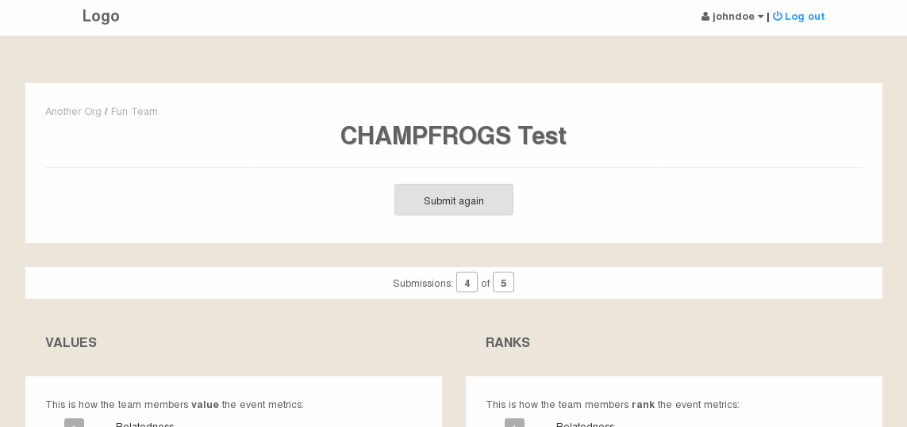

**Event Metrics**

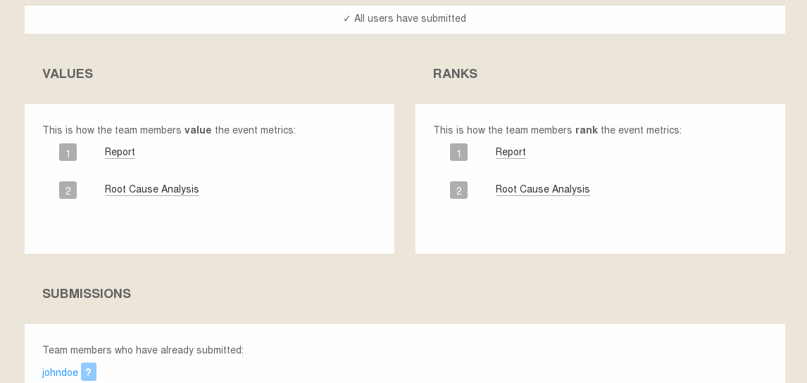

**Metrics for an Individual User**

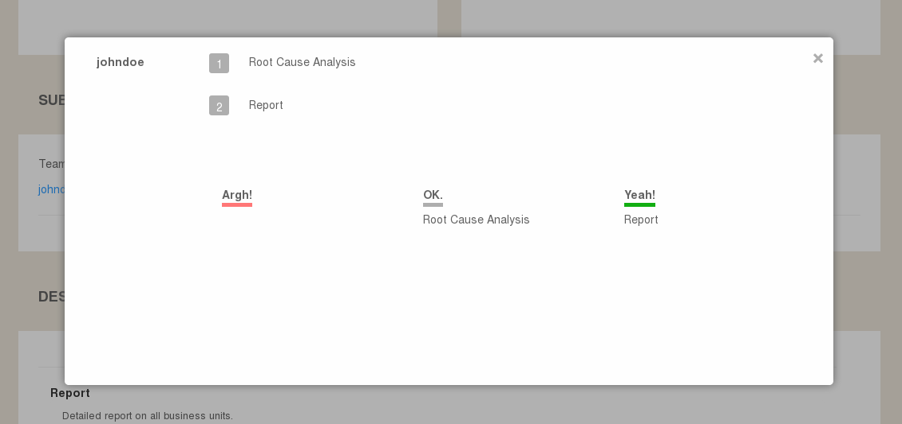

**Events Overview and Search**

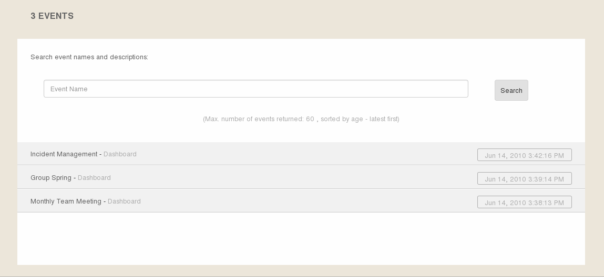

**An Individual User's Organization Memberships**

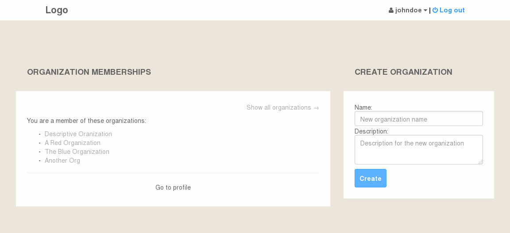

**An Individual User's Team Memberships**

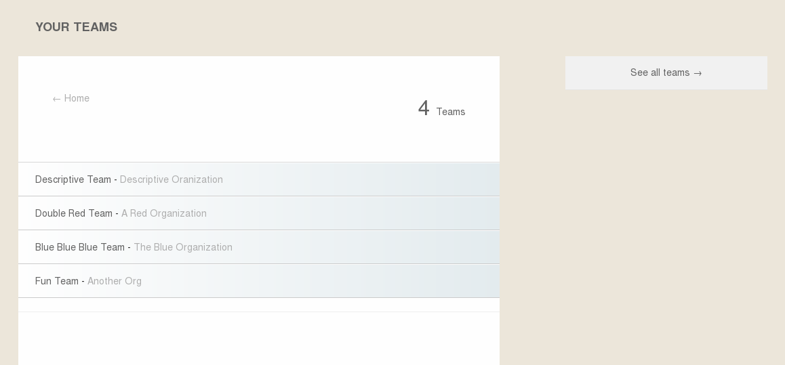

**An Individual User's Unsubmitted Events**

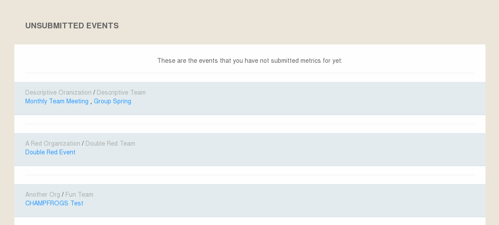
